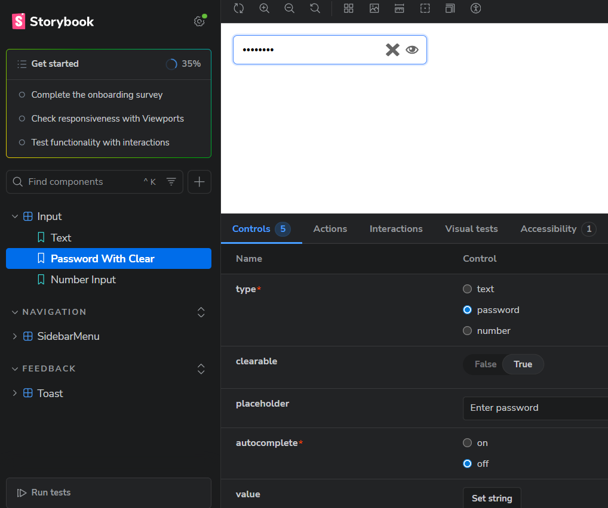
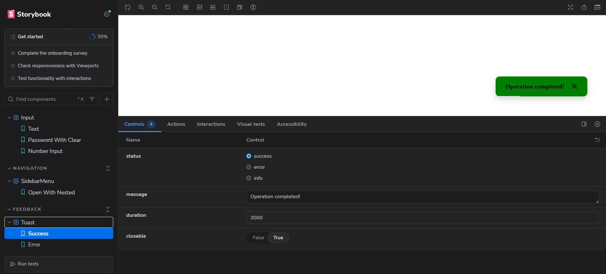
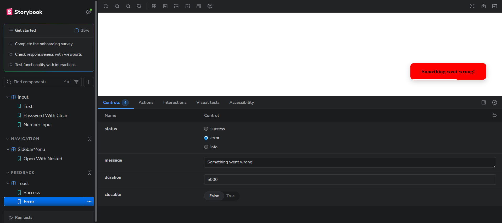
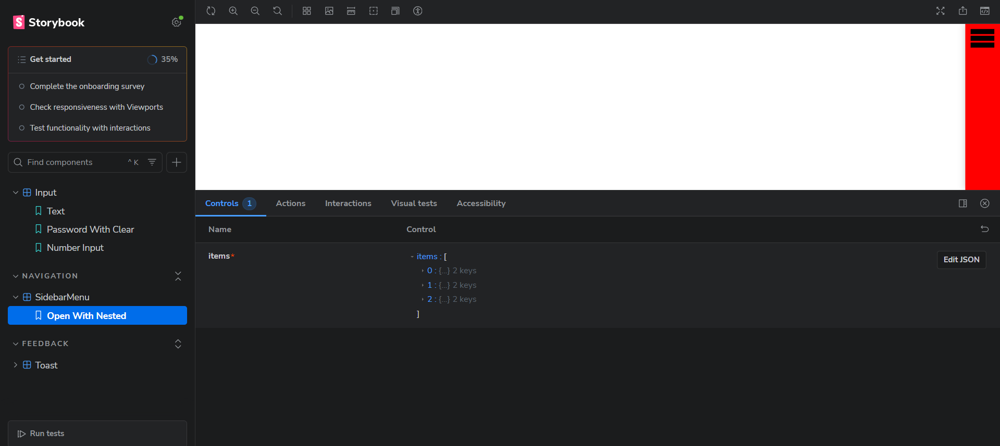
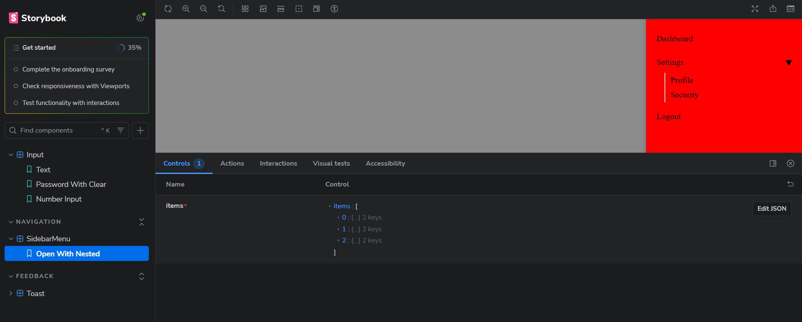

# React UI Component Library

This repository contains a small React component library with Storybook, including:

- Input (text, password with toggle, number, clearable)
- Toast (success, error, info notifications)
- SidebarMenu (sliding sidebar with nested items)

---

## 🚀 Setup Instructions

1. **Clone repository**

```bash
git clone https://github.com/Roki2221/React-component-library-assessment.git
cd React-component-library-assessment
```

2. **Install dependencies**

```bash
npm install
# or
yarn
```

3. **Run Storybook (development)**

```bash
npm run storybook
# or
yarn storybook
```

Open `http://localhost:6006/` in your browser to view Storybook.

4. **Build components / Storybook**

```bash
npm run build
# or
yarn build
```

Make sure your `package.json` has usual scripts like `start`, `storybook`, `build`, `lint`, `format`.

---

## 🧩 Component Overview

### Input Component

The Input component supports multiple types (`text`, `number`, `password`) and includes:

- Password visibility toggle (eye icon)
- Clearable input (`clearable` prop) — shows an "X" to clear the value
- Autocomplete (`autocomplete` prop: "on" or "off")

**Stories include:**

- Text input
- Password input (hidden)
- Password input (visible)
- Clearable combinations

---

### Toast Component

The Toast component shows notifications in the bottom-right corner:

- Supports statuses: `success`, `error`, `info`
- Auto-dismisses after a given duration (`duration` prop in ms)
- Optional manual close button (`closable`)
- Fade/slide transition

**Stories include:**

- Success (closable)
- Error (non-closable)
- Info (different durations)

---

### SidebarMenu Component

The SidebarMenu component is a sliding sidebar from the right:

- Controlled via `open` prop
- Overlay closes sidebar on background click (`onClose` callback)
- Nested items supported (accordion or expandable children)

**Stories include:**

- Closed
- Open with nested 2-level items

---

## 📁 Project Structure

```
src/
├── components/
│   ├── Input/
│   │   ├── Input.tsx
│   │   └── Input.module.css
│   ├── Toast/
│   │   ├── Toast.module.css
│   │   └── Toast.tsx
│   └── SidebarMenu/
│       ├── SidebarMenu.tsx
│       └── SidebarMenu.module.css
├── stories/
│       ├── Input.stories.tsx
│       ├── Toast.stories.tsx
│       └── SidebarMenu.stories.tsx
└── App.tsx
```

---

## 🖼 Screenshots

## Input Component

Text Input:


Password Input with Clear button (password not visible):


Password Input with Clear button (password-visible):


## Toast Component

Success Toast:


Error Toast:


## Sidebar Menu

Closed:

Open with Nested Items:

